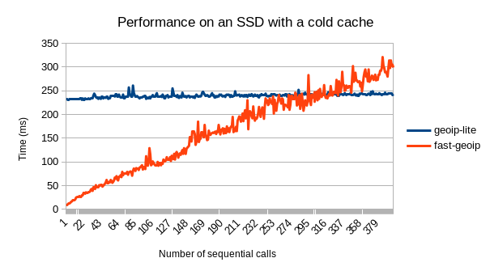
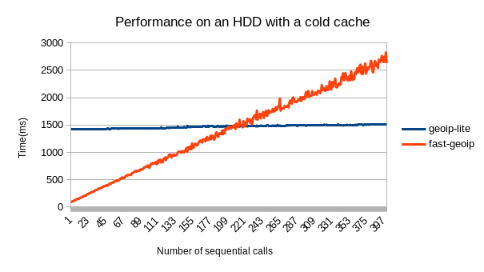
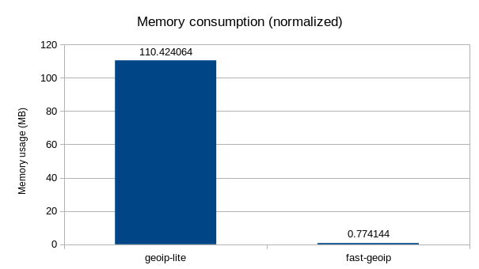
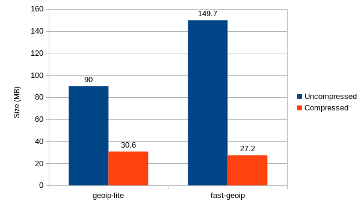
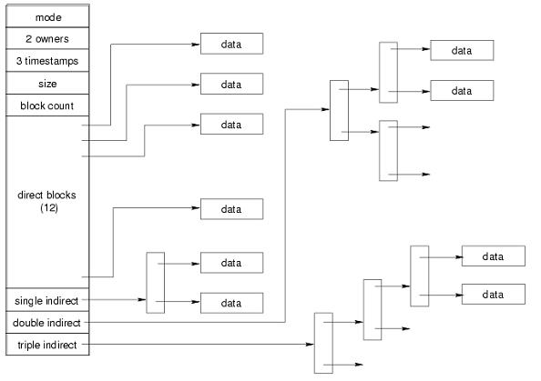

# fast-geoip
> A faster & low-memory replacement for geoip-lite, a node library that maps IPs to geographical information

## Summary
This library provides an interface to efficiently query MaxMind's GeoLite databases, which contain geolocation information for IPs. Concretely, this was created as an alternative to `geoip-lite` that adapts better to use-cases where either a low memory footprint is needed, not many IPs will be examined through the library or a high start-up overhead is unacceptable.

Concretely, what `geoip-lite` does is that, on startup, it reads the whole database from disk, parses it and puts it all on memory, thus this results in the startup time being increased by about ~233 ms along with an increase of memory being used by the process of around ~110 MB, in exchange for any new queries being resolved with low sub-millisecond latencies (~0.02 ms). 

This works if you have a long-running process that will need to geolocate a lot of IPs and don't care about the increases in memory usage nor startup time, but if, for example, your use-case requires only geolocating a single IP, these trade-offs don't make much sense as only a small part of the satabase is needed to answer that query, not all of it.

This library tries to provide a solution for these use-cases by separating the database into chunks and building an indexing tree around them, so that IP lookups only have to read the parts of the database that are needed for the query at hand. This results in the first query taking around 9ms and subsequent ones that hit the disk cache taking 0.7 ms, while memory consumption is kept at around 0.7MB.

Wrapping it up, `geoip-lite` has huge overhead costs but sub-millisecond queries whereas this library doesn't have any overhead costs but its queries are slower (0.7-9 ms).

And, without further addo, here's a code snippet of library usage (note that this library uses promises instead of synchronous functions, this is the only difference between this library and `geoip-lite`)
```js
const geoip = require('fast-geoip');

const ip = "207.97.227.239";
const geo = await geoip.lookup(ip);

console.log(geo);
{
  range: [ 3479298048, 3479300095 ],
  country: 'US',
  region: 'TX',
  eu: '0',
  timezone: 'America/Chicago',
  city: 'San Antonio',
  ll: [ 29.4969, -98.4032 ],
  metro: 641,
  area: 1000
}
```

Finally, to add some historical context, this library was originally built with the idea of using it for a lambda container that had to geolocate the IP of the current request, something that turned out to be impossible to do with `geoip-lite` because memory consumption exceeded the 126MB limit and it slowed down the lambda function by over 200ms just to query a single IP.

## Features
Apart from the performance advantages mentioned before, this package comes with the following extra features:
- Zero dependencies
- Native Typescript types
- Simplicity: npm module is made of less than 200 lines of code
- Compatible with all versions of node since 0.12 (released in february 2015)
- Optimized for auditability (see [Implementation philosophy](#implementation-philosophy))
- 100% test coverage
- Always up-to-date IP databases provided by periodic CI jobs
<!--

## Cache
Once all the data has been loaded into memory, queries are around 1.5 ms slower than `geoip-lite`.

-->

## Benchmarks
Benchmarks were taken on my workstation and should be straightforward to reproduce with the scripts provided in this repo. HDD benchmarks were taken in an old laptop. Specs of both machines are the following:

|              | Workstation              | HDD laptop           |
|--------------|--------------------------|----------------------|
| Disk         | Samsung SSD 840          | Toshiba MQ01ABD0     |
| CPU          | Intel i5-4690K @ 3.50GHz | Intel Atom @ 600 MHz |
| Node version | v12.16.3                 | v8.17.0              |
| Kernel       | 5.6.12-300               | 3.5.3-1              |
| OS           | Fedora                   | OpenSUSE             |
| Architecture | x86\_64                  | i686                 |

### Perfomance
The values in the `Subsequent queries` tab are calculated by taking the median over a lot of samples.

<table>
    <thead>
        <tr>
            <th colspan=4>SSD</th>
            <th colspan=4>HDD</th>
        </tr>
    </thead>
    <tbody>
        <tr>
            <td colspan=2>First query</td>
            <td colspan=2>Subsequent queries</td>
            <td colspan=2>First query</td>
            <td colspan=2>Subsequent queries</td>
        </tr>
        <tr>
            <td>geoip-lite</td>
            <td>fast-geoip</td>
            <td>geoip-lite</td>
            <td>fast-geoip</td>
            <td>geoip-lite</td>
            <td>fast-geoip</td>
            <td>geoip-lite</td>
            <td>fast-geoip</td>
        </tr>
        <tr>
            <td>233 ms</td>
            <td>9 ms</td>
            <td>0.02 ms</td>
            <td>0.7 ms</td>
            <td>1418 ms</td>
            <td>84 ms</td>
            <td>0.25 ms</td>
            <td>6.6 ms</td>
        </tr>
    </tbody>
</table>

Note that generally you won't make queries sequentially but aynschronously, so take the following graphs with a pinch of salt. With that being said, the graphs do a great job at illustrating the "huge overhead & fast queries" vs "no overhead & slow queries" dicotomy. 
 

### Memory
Note that the memory consumption numbers provided in the following figure have had the standard memory consumption of an empty node-js process (~35MB) removed from them in order to only account for the memory increases caused by the module.



### File sizes


## Optimization strategies
The implementation of this library uses several optimization strategies in order to make it as fast as possible under the chosen design constraints and the implementation philosophy outlined below.

Now, the main strategy used here are the indexes that make it possible to efficiently query an item, but the implementation of indexes requires many smaller design decisions to be made, and the filesystem optimization section provides a rationale for all these choices.

### Indexes
The basic concept underpinning this library is a set of multi-level indexes that are constructed with the following process:
1. Get all the IP networks in the database and sort them
2. Split the sorted list into a set of chunks
3. Take the first IP network in each chunk and build a sorted list out of them (called first index)
4. Split the newly created list into another set of chunks and build another sorted list out of them by grouping the first IP in each chunk
5. Store this last list into another file, this will be our root index.

After this process has been done, it's possible to look for an IP in the database by taking the following steps:
1. Load the root index into memory and perform a binary search on it
2. Load the index file associated with the IP that was obtained in the previous step
3. Repeat the previous step to get a file (a portion of the original IP list)
4. Apply binary search on that file to find the details associated with the IP net that contains the queried IP
5. Obtain extra location data from the `locations.json` file by using a pointer provided in the previous step

This algorithm has a logarithmic bound of O(log n), and, in terms of practical performance, it's much more efficient than other O(log n) algorithms such as a simple binary search because it localises the information that is being searched on, thus getting a performance boost from successful cache hits while minimizing the amount of data that has to be read from disk.

To illustrate this imagine a binary search over a list of a million records. Such binary search might hit the records 500.000, 250.000, 125.000, 62.500, ... and, as you can see, each of these records is really separated from the next one in the list, so, because of how caches and disks work (by caching data in blocks of locally-close locations) this would mean a cache miss (on a cold cache) for each of this queries, or, if this data is on disk, a new disk operation for each one of them.

Clearly, this is quite inefficient, but if we were to use indexes such as the ones outlined in the algorithm described before and we split the files such that each one only contained 100 records, then we would only need to load three blocks of 100 locally-close records (assuming that 100 records can be contained in a single disk block). Thus we've managed to reduce the number of disk accesses from log2(1e6)~=20 to 3. Note that at the end of the day this algorithm is still making 20 operations, but we are just arranging data so that we can avoid some disk operations by taking advantage of data locality.

Another way to interpret the data structure described here is as a binary tree, concretely a [B+ tree](https://en.wikipedia.org/wiki/B%2B_tree), which also uses m-ary trees where each node has a large number of child nodes. The main difference between a B+ tree and the system used here is that a B-tree only guarantees that each branch will be half-full, where our index system can guarantee that our tree will be perfectly balanced and all our branches will be as full as possible. The reason why we can get this improvement over B-trees is that B-trees need to provide O(log n) insertion bounds, but given that our list is static and never changes, we can totally ignore that and go for an algorithm with O(n) insertion bounds as, after all, we will never need to insert any node after the data structure has been built.

### Filesystem optimization
Now that the general idea behind this architecture is clear, let's move on to optimizing several of its parameters, such as file and index size.

This type of optimizations rely heavily on the implementation of the underlying filesystem, so we will be focusing on speeding up the library in an environment where the database files are hosted inside an ext4 filesystem. Ext4 is used by all modern linux distributions, so, in practice, this means that the library is optimized to work on Linux. Now this doesn't mean that the library won't be as fast as on Windows or MacOS, it's just that on linux it'll be possible to squeeze a little extra performance. The decision to focus on linux was made because, according to a survey, [98% of public servers on the internet run on Linux-like OSes](https://web.archive.org/web/20150806093859/http://www.w3cook.com/os/summary/) and I expect most of the usage of this library to be on servers.

Once the matter of filesystems has been settled, let's go over a quick primer on how are files stored in ext4. Please feel free to skip this section if you are already familiar with the topic at hand.

When a file is stored, it is initially divided into a set of blocks that are written in independent locations (although the filesystem tries to get them to be contiguous) on the disk. Furthermore, these blocks act as atomic disk units, meaning that all operations must be done on whole blocks, it's impossible to read or write a portion of a block (even if you read a single byte from a file the filesystem is actually reading the whole block and then slicing it to provide you with that 1 byte).

What's more, all blocks have the same size, which depends on the OS and has changed through the years, as it used to be 512 bytes but nowadays it is 4 KB on all modern OSes.
This means that if you have a file that weights 9KB, it will be split into 3 different blocks which, for example, could end up stored at locations 10, 1542 and 4356.

Once block locations have been assigned, references to these are stored in a data structure called `inode` that is associated with the file at hand. To make querying this data structure as efficient as possible while also keeping inode size bounded, the location list is structured in a series of trees: the locations of first 12 blocks of the file are stored as a simple list directly on the inode, the next block locations are put into another list that is stored into another disk block, the location of which is stored on the inode, thus creating a sort of redirection.
This pattern is then repeated with double and triple redirects, as it is illustrated in the following figure (credit for it goes to [this blog post](https://selvamvasu.wordpress.com/2014/08/01/inode-vs-ext4/)).



So, when choosing which size should be the files that our database is split into, one of the things that we want to minimize is the number of disk blocks that have to be read for each file. If this was our only concern we could just go with 4 KB files, but given that the complete database weights ~135 MB this would lead to the creation of 33750 files, which would heavily bloat the directory where they are located. The consequences of that would be the following:
- Unzipping the directory would take much longer because of all the extra file-creation operations that need to be done
- The list of files in a directory are stored inside a file of it's own, so if this list is really large the directory file will span several disk blocks, which will all have to be read before files can be queried
- Directories use a B-tree-like structure to retrieve the information of files that belong to them, so the time spent getting that information grows O(log n) with the number of files in the directory. Therefore, the more files, the slowr that is

Because of these reasons it's important to also minimize the number of files in the directory. A good equilibrium betweens these two optimization targets is achieved with a file size of 48 KB, as that keeps the number of files reasonably low while also making sure that all the 12 disk blocks that compose each file can be accessed from the inode directly without any indirection, a small detail that speeds up the algorithm because it enables all these disk reads to be done in parallel, whereas if we there was an indirection in the middle we'd need to wait for a disk block before we know which blocks we need to retrieve to get the file content (a sequential access pattern instead of a parallel one).

Note that an alternate solution could have been to put the split files into other directories, but that would have the number of indirections the filesystem has to go through to get to a file.

After we have already split all of our files, we need to choose the size of our indexes. An optimal solution for this problem can be achieved by minimizing the equation `x + y`, where `x` is the size of the root index and `y` the size of the middle index, while maintaining the constraint `x * y = n`, where `n` is the number of files that the database has been split into.

Minimizing that equation leads to the following solution `x = y = sqrt(n)`. 

## Implementation philosophy
A major source of inspiration in this design comes from the essay [“Worse is Better”](https://en.wikipedia.org/wiki/Worse_is_better), which posits that simplicity, especially implementation simplicity, is a key contributor to the success of a system. 
I believe that simplicity in both design and implementation is especially important for an npm package, as, apart from the obviously lower bug rate that comes with a simpler implementation, it provides an invaluable property: the ability for anyone to easily audit the code and make sure that it does what it's meant to do and nothing more.
This may seem useless in this day and age, where it's common to have a node\_modules directory with thousands of packages, but I firmly believe that by making it possible for people to read all the code in a package in under one hour, some people will actually do it, and even if only a few do, these provide guarantees for everyone else that is consuming the library, as, if something turns out to be wrong with the library, the few that audit the code will make it known to everyone else.

You can see this philosphy at play in the following choices:
- No dependencies (personally, I think it's impossible to audit a package with dependencies that also bring along other dependencies, as the amount of code at play just grows exponentially to unmanageable levels):
- JSON is used for all parsing, thus avoiding any complicated binary parsing code that would force any reviewers to read and understand the database generation code on top of the code that goes into the package, while also requiring them to know about serialization in javascript and the functions associated with it
- Instead of having the code handle which parts of a file should be loaded, the data is split into multiple files to off-load this work to the file system
- All the important code is in a single file with a low line count
- The code makes use of known patterns to keep it as dumb as possible
- Any usage of the standard library only involves functions that have existed for a long time so that everyone will be familiar with them
- No minification nor transpilation: auditing minified code requires getting the source, building it, comparing it with the minified code and trusting the transpiler/minifier not to change the code's behaviour. Unminified code can be audited by simply reading the files in node\_modules.

You may note that some parts of this philosophy clash with the stated goal of this library, that is, to be perfomant. For example, by changing json as a serialization format for a binary format it should be possible to drastically reduce the database size while also increasing performance (disk will need to read blocks and json parsing can be skipped altogether).

While this is certainly true, such a new system would introduce new complexity that would come with it's own set of problems:
- Library consumers would have a much harder time verifying that the data is correct and that the implementation does nothing wrong. This is quite important for security, as it heavily harms the auditability of the package.
- The system would be much more prone to bugs, maintainability would be lowered and reading the code would require much more internal knowledge. Right now it's possible to understand the system by taking a look at the json files generated and reading the code that queries them, makign it possible to skip the file generation code safely. On the other hand, if this code contained binary parsing logic the reviewer would need to first understand how the generator works and know the details of binary marshmalling in different languages, something not widely known (how is a 2 byte int serialized on python? is it stored in big or little endian form?...).
- Performance might not increase as much as you think. Profiling the library reveals that a very little amount of time is spent on json parsing.

## Alternative architectures tested
When I was prototyping this library one of the ideas I tried was building a binary tree which would use the bits of an IP as it's path to it's geo information. 

Unfortunately this didn't yeld good results because the resulting tree was heavily unbalanced, which made it so cutting it into seperate files at standard heights resulted in a lot of very small files which ended up heavily bloating the filesystem (eg: a file with a single record would weight only ~15 bytes but because of how filesystems are structured it would need to take up the space of a whole disk block, ~4kB in modern OSes). 

Trying to cut the tree into chunks of a setsize also led to problems because of it's unbalanced nature, casing some paths to go through 8 different files to reach it's destination. And, while it may have been possible to come up with an algorithm that solved that problem, at this point it became clear that trying to work around an unbalanced tree by adding complexity was a much inferior approach to directly building a balanced tree using indexes.

## Acknoledgements
Huge thanks to the creators and all contributors to `geoip-lite` for that package, which inspired this one.
